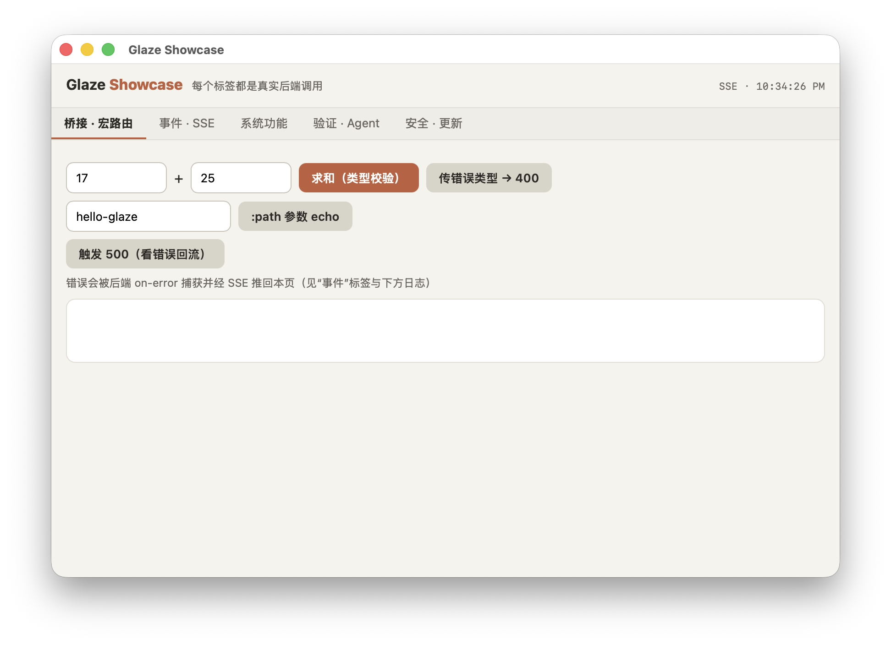

# Glaze

Build desktop apps with a [Racket](https://racket-lang.org/) backend and a web frontend. A [Tauri](https://tauri.app/)-like framework for Racket — write your app logic in Racket, build your UI with HTML/CSS/JS, and ship a desktop application.

[](https://github.com/turinglambdaai/glaze/actions/workflows/ci.yml)  [](LICENSE) [](CHANGELOG.md)

**English** · [中文](README.zh-CN.md)

<p align="center"></p>

## Why Glaze?

Racket's `racket/gui` works but is hard to style into a modern product-grade UI. Glaze takes a different approach: serve a local web app from Racket and display it in the system browser (Phase 1) or an embedded WebView (Phase 3).

You get:

- **Racket for logic** — the full power of Racket's macro system, contracts, pattern matching
- **Web for UI** — Tailwind, Svelte, React, or any web framework
- **JSON API bridge** — the page calls Racket with plain `fetch("/api/...")`

### How it compares

| | Glaze | Tauri | Electron | wails |
|---|---|---|---|---|
| Backend language | Racket | Rust | JS/Node | Go |
| Native toolchain needed | **none** (pure FFI) | Rust + cargo | none | Go + WebView2 deps |
| Binary size | tiny (Racket exe + assets) | small | 100 MB+ | small |
| Frontend→backend | HTTP JSON routes (`fetch`) | `invoke()` IPC | Node APIs | bindings |
| Works without webview (browser fallback) | **yes** | no | no | no |
| Agent-friendly UI verification (`title`/`url`/screenshot) | **built-in** | via WebDriver | via CDP | limited |
| WebView backends | WebView2 / WKWebView / WebKitGTK | same | bundled Chromium | WebView2/WKWebView |

All three webview backends pass the real-window CI e2e (open, load, capture, navigate, close, on-close). Remaining honest gaps: no typed IPC layer (plain JSON), Linux needs a desktop session or Xvfb.

## Platform status

| Capability | macOS | Windows | Linux |
|---|---|---|---|
| HTTP server + browser | ✅ | ✅ | ✅ |
| System tray | ✅ | ✅ | ✅ (CI-verified) |
| JSON API bridge | ✅ | ✅ | ✅ |
| Native webview window | ✅ verified end-to-end | ✅ CI e2e (WebView2) | ✅ CI e2e (Xvfb + WebKitGTK) |
| `webview-title` / `webview-url` | ✅ | ✅ | ✅ |
| `webview-capture!` (screenshot) | ✅ | ✅ (PrintWindow + PowerShell PNG) | ✅ (gdk_pixbuf) |
| `#:devtools?` | ✅ (inspectable, macOS 13+) | ✅ (`OpenDevToolsWindow`) | ✅ (WebKitGTK inspector) |

Without a native backend, `run-app` / `open-window` automatically fall back to the system browser — the app still works everywhere.

## Requirements

| Dependency | Purpose |
|------------|---------|
| [Racket](https://racket-lang.org/) | 7.0 or later (includes `raco`) |

## Quick Start

### 1. Install

```bash
raco pkg install --auto glaze
```

A single Racket package: this installs the `glaze` library, the `raco glaze` CLI, and the documentation (browse it later with `raco docs`).

### 2. Create a new project

```bash
raco glaze init myapp
cd myapp
```

### 3. Run

```bash
racket main.rkt
```

A native window opens showing your app served from a local HTTP server; without a WebView backend it falls back to the system browser at `http://127.0.0.1:<port>`.

> Prefer installing straight from a GitHub checkout instead of the catalog?
> ```bash
> git clone https://github.com/turinglambdaai/glaze.git
> cd glaze
> raco pkg install --auto --link "$PWD"
> ```
> To work on Glaze itself, see [CONTRIBUTING.md](CONTRIBUTING.md).

## CLI Commands

```bash
raco glaze init <name>       # Create a new Glaze project
raco glaze dev               # Start dev server with auto-open browser
raco glaze build             # Build a distributable (exe + bundled assets)
raco glaze keygen            # Create an RSA keypair for license signing
raco glaze license           # Sign or verify offline license files
raco glaze help              # Show help
```

### `build`

Package a Glaze project into a platform distribution (`raco exe` + `raco distribute`) with the frontend assets bundled alongside the executable. On macOS the distribution is a proper `.app` bundle with your `--version` stamped into `Info.plist`.

```bash
raco glaze build --name myapp              # produces dist/myapp(.exe) + dist/lib + dist/public
raco glaze build --name myapp --version 1.2.0 --installer  # + msi / dmg / AppImage (zip/tar.gz fallback)
```

Options: `--name`, `--version`, `--icon <.ico/.icns>`, `--entry <path>` (default `main.rkt`), `--out <dir>` (default `dist`), `--embed-dlls` (Windows: single-file exe), `--installer`.

> The installer step probes for the native toolchain (WiX / NSIS on Windows, `create-dmg` / `hdiutil` on macOS, `appimagetool` / `linuxdeploy` on Linux) and **degrades gracefully** to a `.zip` / `.tar.gz` when it's absent, printing a warning naming what to install.

### Code signing & notarization

Unsigned apps get blocked by macOS Gatekeeper and Windows SmartScreen. `build` drives the platform signer for you:

```bash
# macOS — Developer ID identity, hardened runtime, notarize + staple:
raco glaze build --name myapp \
  --sign "Developer ID Application: Acme Inc (TEAMID)" \
  --notarize acme-notary --installer

# macOS — ad-hoc (no cert; for local testing / CI):
raco glaze build --name myapp --sign -

# Windows — signtool with a certificate thumbprint (RFC-3161 timestamped):
raco glaze build --name myapp --sign 40HEXCHARS --installer
```

Details: `--sign` takes a codesign identity (macOS) or a SHA-1 thumbprint / subject name for `signtool` (Windows). Hardened runtime is applied automatically on macOS unless `--no-hardened-runtime` is passed (and is skipped for ad-hoc, where its library validation would reject the app's own framework). `--notarize <keychain-profile>` submits the built dmg via `notarytool`, waits, and staples the ticket. `--entitlements <file>`, `--timestamp-url <url>` round it out. Signing failures abort the build; a *missing toolchain* degrades with a loud warning.

### Licensing (paid apps)

`glaze/license` ships an offline license-key scheme with zero native dependencies — RSA-2048/SHA-256 signatures via the system `openssl` CLI, present on every platform:

```bash
# vendor side — once:
raco glaze keygen --out keys                # keys/private.pem + keys/public.pem
# per customer (optionally expiry- and machine-bound):
raco glaze license sign --key keys/private.pem --product "MyApp" \
  --subject "customer@example.com" --expiry 2027-12-31 --out app.license
raco glaze license verify --pub keys/public.pem --product "MyApp" app.license
```

```racket
(require glaze/license)

(define r (validate-license "app.license" #:public-key "keys/public.pem" #:product "MyApp"))
(unless (hash-ref r 'valid)
  (error 'myapp "license invalid: ~a" (hash-ref r 'reason)))   ; expired / machine / signature ...

;; machine binding: a stable per-machine digest of the OS machine id
(issue-license ... #:machine-id (machine-id))
```

Failure reasons are stable tags (`missing-file`, `malformed`, `signature`, `product`, `expired`, `machine`, `openssl-unavailable`) suitable for UI messages. Honest scope: this defends against casual license sharing — a local attacker can always patch a binary; it is not tamper resistance.

### Update integrity

`check-update` passes through an optional `"sha256"` manifest field; verify a downloaded artifact before swapping it in:

```racket
(define info (check-update manifest-url #:current-version "1.0.0"))
;; app downloads (hash-ref info 'url) ... then:
(verify-file-sha256 artifact (hash-ref info 'sha256))   ; #t / #f (#f = cannot verify)
```

## Project Structure

A new Glaze project looks like this:

```
myapp/
├── main.rkt          # Racket entry point
└── public/
    └── index.html    # Frontend
```

`main.rkt` starts a local HTTP server serving files from `public/` and opens the browser:

```racket
#lang racket/base

(require glaze)

(define-values (port server)
  (start-dev-server #:public-dir "public"))

(printf "Glaze app running at http://127.0.0.1:~a\n" port)
(open-browser (format "http://127.0.0.1:~a" port))

(with-handlers ([exn:break?
                 (lambda (e)
                   (stop-server server)
                   (printf "Server stopped.\n"))])
  (sync never-evt))
```

## Repository Structure

One installable package at the repo root; each top-level directory is a Racket collection:

```
glaze/                # repo root = the `glaze` package (info.rkt)
├── glaze/            # Library: server, API bridge, webview, tray, sys, build, app
├── glaze-cli/        # CLI tool (raco glaze init / dev / build)
├── glaze-doc/        # Documentation (Scribble)
├── glaze-test/       # Test suite
├── examples/         # Runnable examples
└── scripts/          # CI helper scripts (webview e2e)
```

## API

### `run-app`

The one-call entry: picks a free port, starts the server (static + JSON API), opens the native webview window, and blocks until the window closes.

```racket
(run-app #:public-dir "public"
         #:api (list (GET "api/ping" ...)))
;; webview path: window closed -> server stopped -> (values 'webview shutdown)
;; browser fallback (no native backend): opens browser -> (values 'browser shutdown)
```

### `start-server` / `start-dev-server`

Starts a local HTTP server serving static files with SPA fallback, plus optional JSON API routes. `start-dev-server` is a backward-compatible alias.

```racket
(start-server #:port 8080
              #:public-dir "public"
              #:api (list (GET "api/ping" (lambda (req) (hasheq 'pong #t)))))
;; Returns (values port shutdown-proc); verifies the listener is accepting
;; before returning.
```

### `stop-server`

Stops the server.

```racket
(stop-server shutdown-proc)
```

### `open-browser`

Opens a URL in the system default browser (cross-platform: Windows, macOS, Linux).

```racket
(open-browser "http://127.0.0.1:8080")
```

## JavaScript Bridge

The frontend calls Racket with plain `fetch("/api/...")` — Glaze's answer to Tauri's `invoke()`. One code path works in the embedded WebView, in the system-browser fallback, and in dev (curl-able). Routes are ordinary values:

```racket
(require glaze)

(GET  "api/ping"            (lambda (req) (hasheq 'pong #t)))
(POST "api/items/:id/bump"  (lambda (req id) (hasheq 'id id 'bumped #t)))
(POST "api/echo"            (lambda (req)
                              (define body (request-json-body req))
                              (hasheq 'echo body)))
```

- Handlers take the request plus captured `:params`; return a jsexpr (auto-wrapped as JSON 200) or a full response.
- `request-json-body` parses the JSON body — note Racket jsexpr parses JSON object keys as **symbols** (`(hash-ref body 'delta)`).
- A handler that raises becomes a 500 JSON error, never a broken connection.
- Unmatched requests fall through to static files (SPA `index.html` fallback).

In the page:

```js
const s = await fetch('/api/counter/bump',
  {method:'POST', headers:{'Content-Type':'application/json'},
   body: JSON.stringify({delta: 5})}).then(r => r.json());
```

### Typed routes, one declaration — `define-api-routes`

```racket
(define-api-routes api
  [(POST "api/counter/bump")
   (bump [delta exact-nonnegative-integer? 1])   ; required, checked, or default
   (hasheq 'count (add1 delta))])
```

One clause defines a Racket procedure (`bump`), a route (bad input → a 400
naming the parameter; handler errors → 500), and a JS client entry — the
served `/glaze/api.js` exposes `glaze.api.counterBump({delta: 5})`, plus
`glaze.call(method, path, body)` and `glaze.on(name, fn)`.

### Backend → frontend push (SSE)

```racket
(define bus (make-event-bus))
(start-server ... #:events bus)
(bus-broadcast! bus 'count-changed (hasheq 'count 42))   ; from any thread
```

```js
glaze.on('count-changed', s => render(s.count));
```

The page can also use `new EventSource('/glaze/events')` directly. Works in
the browser fallback too — same origin, no extra port.

### Security

- Requests are only served for Host headers `127.0.0.1` / `localhost` /
  `[::1]` (DNS-rebinding guard; hostile origins get 403).
- API handlers never crash the connection — parameter problems are 400
  JSON, handler exceptions are 500 JSON (and reach `run-app`'s
  `#:on-error` for crash reporting hooks).
- Optional API token (`#:api-token`): guards API routes and the SSE stream
  (401 otherwise). The app window opens a one-time `?glaze-token=` bootstrap
  URL that exchanges the token for an `HttpOnly` cookie (api.js deliberately
  hands out nothing); programmatic clients send `X-Glaze-Token`.
  Honest scope: defense-in-depth against casual local callers — a process
  of the same user can still read the token from process memory.
- Update checks: `run-app #:check-update <manifest-url> #:current-version "1.0.0"`
  fetches `{"version","url","notes"}`, reports to stderr and broadcasts
  `update-available`. Self-replacement stays the app's decision.

See [`examples/counter/`](examples/counter/) for the complete working app.

## System Integrations (`glaze/sys`)

```racket
(require glaze/sys)
(clipboard-set! "hello")            ; (clipboard-get)
(notify! "Download finished" "report.pdf is ready")
(open-path "/Users/me/report.pdf")  ; default handler
(reveal-path "/Users/me/report.pdf"); Finder/Explorer, selected
(unless (single-instance? "com.me.app") (exit 0))
```

Desktop notifications work on all three platforms (osascript /
notify-send / WinRT toast via PowerShell).

Window controls (from `glaze/webview`): `webview-set-title!`,
`webview-set-size!`, `webview-set-fullscreen!`.

## System Tray

Glaze provides a cross-platform system tray so your app can live in the notification area / menu bar with a right-click (or left-click on macOS) menu. The backend is chosen by platform — pure Racket FFI, no native compilation required:

- **Windows** — `Shell_NotifyIconW` via `ffi/unsafe`
- **macOS** — `NSStatusItem` / `NSMenu` via `ffi/unsafe/objc`
- **Linux** — `libayatana-appindicator` + `libgtk-3` via `ffi/unsafe`

If a platform's native libraries aren't available at runtime, the tray silently degrades to a no-op so the rest of the app keeps working.

```racket
(require glaze)

(define t
  (make-tray #:icon #f
             #:tooltip "My Glaze App"
             #:menu (list (make-menu-item "Quit"
                                          #:action (lambda () (exit 0))))))
(tray-set-tooltip! t "running")
;; ...later
(tray-close t)
```

> **macOS note:** a pure menu-bar app (no Dock icon) requires building as an `.app` bundle with `LSUIElement` set — `raco glaze build` configures this for you.

## App Platform APIs

Beyond the server/webview core, Glaze ships the desktop-app odds and ends commercial apps need:

```racket
(require glaze)

;; ---- native file dialogs (NSOpenPanel / comdlg32 / zenity-kdialog) ----
(define f (pick-file #:title "Open report" #:filters '(("Reports" "*.rep" "*.csv"))))
(define dir (pick-folder #:title "Where?"))
(define out (save-file-dialog #:title "Save as" #:default-name "out.rep"))
;; #f = cancelled; check (dialog-supported?) for a graceful path.

;; ---- menu bar (declarative, three platforms) ----
(webview-set-menu! wv
  (list (make-menu "File"
                   (list (make-menu-item "Open…" #:accel "CmdOrCtrl+O"
                                         #:action open-doc)
                         menu-separator
                         (make-menu-item "Quit" #:action (lambda () (exit 0)))))))
;; macOS accelerators really fire; Windows/Linux show them (v1).

;; ---- deep links (myapp://...) ----
(ensure-url-scheme! "myapp")            ; Windows registry / Linux xdg;
                                        ; macOS via build --url-scheme

;; ---- launch at login ----
(auto-launch-set! "MyApp" #t)
(auto-launch-enabled? "MyApp")

;; ---- multi-window ----
(for ([w (all-webviews)]) (webview-focus! w))
(wait-for-webviews)                      ; block until every window closes
```

## Examples

| Example | What it shows |
|---|---|
| [`examples/showcase/`](examples/showcase/) | **Kitchen sink (start here)** — every capability in one window |
| [`examples/hello/`](examples/hello/) | Minimal app — `run-app` in 8 lines |
| [`examples/counter/`](examples/counter/) | JS↔Racket bridge — `fetch` calls Racket state |
| [`examples/webview-demo.rkt`](examples/webview-demo.rkt) | Webview lifecycle: load, navigate, close, verification APIs |
| [`examples/agent-verify.rkt`](examples/agent-verify.rkt) | Agent workflow: assert page state + screenshot with no human |
| [`examples/tray-demo.rkt`](examples/tray-demo.rkt) | Cross-platform system tray with a working menu |

## Roadmap

- [x] **Phase 1** — Local HTTP server + system browser
- [x] **Phase 2** — Frontend asset bundling, system tray, app packaging
- [x] **Phase 3** — Native WebView embedding (WebView2 / WKWebView / WebKitGTK) — *done, verified by the 3-OS CI e2e*

> **Phase 3 done:** all three backends (macOS WKWebView, Windows WebView2, Linux
> WebKitGTK) pass the real-window CI e2e — open, page load, `webview-title`/`url`
> verification, `webview-capture!` screenshots, `webview-navigate`, close (programmatic
> and OS chrome), and `#:on-close` callbacks; `#:devtools?` and resize-follow on all
> three platforms. Pure Racket FFI throughout, no compiler. Remaining polish
> (not a blocker): multi-window ergonomics.

## License

Licensed under the [MIT License](LICENSE).
