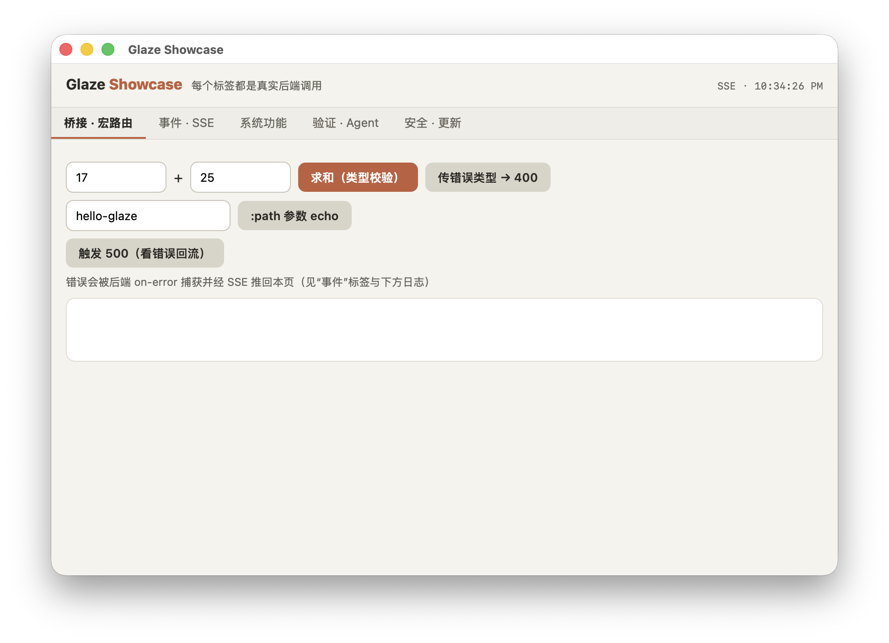

# Glaze

Build desktop apps with a [Racket](https://racket-lang.org/) backend and a web frontend. A [Tauri](https://tauri.app/)-like framework for Racket — write your app logic in Racket, build your UI with HTML/CSS/JS, and ship a desktop application.

**Human-first. Agent-native. Local by design.**

[](https://github.com/turinglambdaai/glaze/actions/workflows/ci.yml)  [](LICENSE) [](CHANGELOG.md)

**English** · [中文](README.zh-CN.md)

<p align="center"></p>

## Why Glaze?

Racket's `racket/gui` works but is hard to style into a modern product-grade UI. Glaze takes a different approach: Racket serves the local application frontend and displays it inside a **native desktop window** backed by the OS WebView — WebView2 on Windows, WKWebView on macOS, and WebKitGTK on Linux.

You get:

- **Racket for logic** — the full power of Racket's macro system, contracts, pattern matching
- **Web for UI** — Tailwind, Svelte, React, or any web framework
- **Native desktop shell** — a real OS window with an embedded system WebView
- **JSON API bridge** — the page calls Racket with plain `fetch("/api/...")`
- **Runtime capabilities** — default-deny route permissions with path and command scopes
- **Scoped filesystem plugin** — text/binary I/O, directories, metadata, copy/move/remove
- **Scoped shell plugin** — bounded command output, timeouts, managed background processes
- **Persistent store plugin** — atomic JSON stores, debounced auto-save, change events
- **System plugins** — scoped clipboard, notifications, opener, and OS information
- **Path resolver** — app directories, resources, portable overrides, path utilities
- **Scoped HTTP client** — bounded requests, timeouts, redirect re-authorization
- **Scoped SQLite plugin** — parameterized select/execute and owned connections

Glaze is deliberately **GUI-first**. If the required native WebView runtime is missing or broken, startup fails with platform-specific installation/repair instructions. It does **not** silently turn the desktop app into a browser tab.

### How it compares

| | Glaze | Tauri | Electron | wails |
|---|---|---|---|---|
| Backend language | Racket | Rust | JS/Node | Go |
| Native toolchain needed | **none** (pure FFI) | Rust + cargo | none | Go + WebView2 deps |
| Binary size | tiny (Racket exe + assets) | small | 100 MB+ | small |
| Frontend→backend | HTTP JSON routes (`fetch`) | `invoke()` IPC | Node APIs | bindings |
| Runtime authority | Route permissions + resource scopes | Capabilities + permissions | app-defined | app-defined |
| WebView backends | WebView2 / WKWebView / WebKitGTK | system WebView | bundled Chromium | WebView2/WKWebView |
| Missing WebView behavior | **fail fast + install guidance** | prerequisite error | n/a (bundled) | prerequisite error |
| Agent-friendly UI verification (`title`/`url`/screenshot) | **built-in** | via WebDriver | via CDP | limited |

All three WebView backends pass the real-window CI e2e (open, load, capture, navigate, close, on-close). Remaining honest gaps: no typed IPC layer (plain JSON), Linux needs a desktop session or Xvfb.

## Platform status

| Capability | macOS | Windows | Linux |
|---|---|---|---|
| Local HTTP application server | ✅ | ✅ | ✅ |
| System tray | ✅ | ✅ | ✅ (CI-verified) |
| JSON API bridge | ✅ | ✅ | ✅ |
| Capability-gated API routes | ✅ | ✅ | ✅ |
| Scoped filesystem plugin | ✅ | ✅ | ✅ |
| Scoped shell/process plugin | ✅ | ✅ | ✅ |
| Persistent key-value store plugin | ✅ | ✅ | ✅ |
| Capability-gated system plugins | ✅ | ✅ | ✅ |
| App/user/resource path resolver | ✅ | ✅ | ✅ |
| Capability-gated HTTP client | ✅ | ✅ | ✅ |
| Capability-gated SQLite plugin | ✅ | ✅ | ✅ |
| Native WebView window | ✅ verified end-to-end | ✅ CI e2e (WebView2) | ✅ CI e2e (Xvfb + WebKitGTK) |
| `webview-title` / `webview-url` | ✅ | ✅ | ✅ |
| `webview-capture!` (screenshot) | ✅ | ✅ (PrintWindow + PowerShell PNG) | ✅ (gdk_pixbuf) |
| `#:devtools?` | ✅ (inspectable, macOS 13+) | ✅ (`OpenDevToolsWindow`) | ✅ (WebKitGTK inspector) |
| Window geometry + persisted state | ✅ | ✅ | ✅ |

Native WebView support is mandatory for application startup. `run-app` and `open-window` never open the system browser as a fallback.

## Requirements

| Platform | Runtime requirement |
|---|---|
| All | [Racket](https://racket-lang.org/) 9.0 or later, CS runtime (includes `raco`) |
| Windows | Microsoft Edge WebView2 Runtime (Evergreen). Glaze ships `WebView2Loader.dll`; install/repair the Runtime if startup says it is unavailable. |
| macOS | WKWebView is built into macOS; run inside a logged-in graphical session. |
| Linux | GTK 3 + WebKitGTK (`libwebkit2gtk-4.1-0` on current Debian/Ubuntu; distro equivalent elsewhere) and a graphical desktop session/Xvfb. |

When startup cannot initialize the native backend, Glaze preserves the underlying backend error and adds actionable installation/repair guidance. Interactive desktop apps also attempt to show the same diagnosis in an OS-level error dialog, which matters for packaged Windows `--gui` executables that have no console. CI suppresses the dialog automatically; `GLAZE_NO_STARTUP_DIALOG=1` disables it explicitly.

## Quick Start

### 1. Install

```bash
raco pkg install --auto glaze
```

A single Racket package: this installs the `glaze` library, the `raco glaze` CLI, and the documentation (browse it later with `raco docs`).

### 2. Create a new project

```bash
raco glaze init myapp
cd myapp
```

### 3. Run

```bash
racket main.rkt
# or
raco glaze dev
```

A native desktop window opens and hosts the frontend served by the local Racket server. If the required WebView runtime is missing, startup stops and tells you what to install instead of opening Chrome/Edge/Safari.

> Prefer installing straight from a GitHub checkout instead of the catalog?
> ```bash
> git clone https://github.com/turinglambdaai/glaze.git
> cd glaze
> raco pkg install --auto --link "$PWD"
> ```
> To work on Glaze itself, see [CONTRIBUTING.md](CONTRIBUTING.md).

## CLI Commands

```bash
raco glaze init <name>       # Create a native Glaze desktop project
raco glaze inspect --json    # Read the project/edit/verification contract
raco glaze doctor --json     # Diagnose package and native WebView readiness
raco glaze dev               # Run this project's native desktop app
raco glaze verify            # Assert title/URL and capture the native window
raco glaze build             # Build a distributable (exe + bundled assets)
raco glaze keygen            # Create an RSA keypair for license signing
raco glaze updater-keygen    # Create an Ed25519 update-signing keypair
raco glaze update-sign       # Sign an update artifact
raco glaze update-verify     # Verify an artifact and pinned-key signature
raco glaze manifest-sign     # Validate and sign a complete update manifest
raco glaze manifest-verify   # Verify a manifest signature and pinned key id
raco glaze license           # Sign or verify offline license files
raco glaze help              # Show help
```

There is intentionally no browser-mode `dev`/`serve` command. Development and production use the same native WebView path so missing dependencies and native-backend failures cannot be hidden by a browser fallback.

`init` also creates `AGENTS.md` and a runnable `verify.rkt`. This gives coding
agents explicit edit boundaries, machine-readable inspection/diagnostics, and
native-window evidence with meaningful exit codes. See the
[agent-native workflow](docs/agent-native.md).

### `build`

Package a Glaze project into a platform distribution (`raco exe` + `raco distribute`) with the frontend assets bundled alongside the executable. On macOS the distribution is a proper `.app` bundle with your `--version` stamped into `Info.plist`.

```bash
raco glaze build --name myapp
raco glaze build --name myapp --version 1.2.0 \
  --publisher "Acme Inc" --identifier com.acme.myapp --installer
```

Options: `--name`, `--version`, `--publisher`, `--identifier`, `--icon <.ico/.icns>`, `--entry <path>` (default `main.rkt`), `--out <dir>` (default `dist`), `--embed-dlls` (Windows: single-file exe), `--installer`. Keep `--identifier` stable across releases: Glaze derives the WiX `UpgradeCode` and NSIS uninstall registry identity from it.

> The installer step probes for the native packaging toolchain (WiX / NSIS on Windows, `create-dmg` / `hdiutil` on macOS, `appimagetool` / `linuxdeploy` on Linux) and **degrades gracefully** to a `.zip` / `.tar.gz` when that packaging toolchain is absent, printing a warning naming what to install. This packaging fallback is unrelated to application startup: the app itself still requires a native WebView.

### Code signing & notarization

Unsigned apps get blocked by macOS Gatekeeper and Windows SmartScreen. `build` drives the platform signer for you:

```bash
# macOS — Developer ID identity, hardened runtime, notarize + staple:
raco glaze build --name myapp \
  --sign "Developer ID Application: Acme Inc (TEAMID)" \
  --notarize acme-notary --installer

# macOS — ad-hoc (no cert; for local testing / CI):
raco glaze build --name myapp --sign -

# Windows — signtool with a certificate thumbprint (RFC-3161 timestamped):
raco glaze build --name myapp --sign 40HEXCHARS --installer
```

Details: `--sign` takes a codesign identity (macOS) or a SHA-1 thumbprint / subject name for `signtool` (Windows). Hardened runtime is applied automatically on macOS unless `--no-hardened-runtime` is passed (and is skipped for ad-hoc, where its library validation would reject the app's own framework). `--notarize <keychain-profile>` submits the built dmg via `notarytool`, waits, and staples the ticket. `--entitlements <file>`, `--timestamp-url <url>` round it out. Signing failures abort the build; a *missing toolchain* degrades with a loud warning.

### Licensing (paid apps)

`glaze/license` ships an offline license-key scheme with zero native dependencies — RSA-2048/SHA-256 signatures via the system `openssl` CLI:

```bash
raco glaze keygen --out keys
raco glaze license sign --key keys/private.pem --product "MyApp" \
  --subject "customer@example.com" --expiry 2027-12-31 --out app.license
raco glaze license verify --pub keys/public.pem --product "MyApp" app.license
```

```racket
(require glaze/license)

(define r (validate-license "app.license" #:public-key "keys/public.pem" #:product "MyApp"))
(unless (hash-ref r 'valid)
  (error 'myapp "license invalid: ~a" (hash-ref r 'reason)))

(issue-license ... #:machine-id (machine-id))
```

Failure reasons are stable tags (`missing-file`, `malformed`, `signature`, `product`, `expired`, `machine`, `openssl-unavailable`) suitable for UI messages. Honest scope: this defends against casual license sharing — a local attacker can always patch a binary; it is not tamper resistance.

### Update integrity

`check-update` remains the small, backward-compatible notification helper. For installed applications, the full updater validates a signed manifest, selects the platform/architecture and release channel, enforces staged-rollout and download-size limits, verifies SHA-256 plus an optional artifact signature, and executes an install plan with rollback:

```racket
(define manifest
  (fetch-update-manifest manifest-url pinned-public-key
                         #:key-id "release-2026"))
(define candidate (select-update config manifest))
(when candidate
  (define artifact (download-update config candidate download-path))
  (execute-install-plan!
   (make-replace-install-plan candidate artifact installed-path
                              #:restart restart-app)))
```

Portable artifacts (including AppImage-style deployments) can use the atomic replacement adapter above. MSI/EXE/PKG/DMG installers use `make-install-plan` with a platform adapter that owns elevation and process handoff; Glaze still controls the verified input and invokes rollback when installation fails.

Release automation can sign both artifacts and the validated manifest with the same pinned Ed25519 key:

```bash
raco glaze updater-keygen --out updater-keys
raco glaze update-sign --artifact app.zip --key updater-keys/private.pem --out app.zip.sig
raco glaze update-verify --artifact app.zip --pub updater-keys/public.pem \
  --signature app.zip.sig --sha256 <manifest-sha256>
raco glaze manifest-sign --manifest manifest.json --key updater-keys/private.pem \
  --key-id release-2026 --out manifest.signed.json
raco glaze manifest-verify --manifest manifest.signed.json \
  --pub updater-keys/public.pem --key-id release-2026
```

## Project Structure

A new Glaze project looks like this:

```
myapp/
├── main.rkt          # Racket entry point
└── public/
    └── index.html    # Frontend
```

`raco glaze init` generates a native-window entry point. The call is deliberately top-level so the same file also starts correctly when `raco glaze build` packages it through the generated wrapper:

```racket
#lang racket/base

(require racket/runtime-path
         glaze)

(define-runtime-path public "public")

(run-app #:public-dir public
         #:title "myapp")
```

`run-app` starts the local HTTP application server, opens the native WebView window, and shuts the server down when the window closes. A native-backend failure is fatal and includes dependency guidance.

## Repository Structure

One installable package at the repo root; each top-level directory is a Racket collection:

```
glaze/                # repo root = the `glaze` package (info.rkt)
├── glaze/            # Library: server, API bridge, webview, tray, sys, build, app
├── glaze-cli/        # CLI tool (raco glaze init / dev / build)
├── glaze-doc/        # Documentation (Scribble)
├── glaze-test/       # Test suite
├── examples/         # Runnable examples
└── scripts/          # CI helper scripts (webview e2e)
```

## API

### `run-app`

The one-call entry: picks a free port, starts the server (static + JSON API), opens the native WebView window, and blocks until the window closes.

```racket
(run-app #:public-dir "public"
         #:api (list (GET "api/ping" ...))
         #:capability main-capability
         #:app-id "com.example.myapp"
         #:window-state #t)
;; window closes -> server stops -> (values 'webview shutdown)
```

If native WebView startup fails, `run-app` shuts down the local server and raises the same actionable startup error. There is no `#:fallback-browser?` option.

### `start-server` / `start-dev-server`

Starts a local HTTP server serving static files with SPA fallback, plus optional JSON API routes. `start-dev-server` is a backward-compatible alias for the server primitive; it does not define Glaze's application UI mode.

```racket
(start-server #:port 8080
              #:public-dir "public"
              #:api (list (GET "api/ping" (lambda (req) (hasheq 'pong #t)))))
```

### `open-browser`

Low-level utility for opening an external URL in the user's default browser (for example, product documentation or an OAuth page). `run-app` and `open-window` do not call it as a fallback.

```racket
(open-browser "https://example.com/docs")
```

## JavaScript Bridge

The embedded frontend calls Racket with plain `fetch("/api/...")` — Glaze's answer to Tauri's `invoke()`. The local HTTP bridge is easy to exercise independently with developer tools such as `curl`.

```racket
(require glaze)

(GET  "api/ping"            (lambda (req) (hasheq 'pong #t)))
(POST "api/items/:id/bump"  (lambda (req id) (hasheq 'id id 'bumped #t)))
(POST "api/echo"            (lambda (req)
                               (define body (request-json-body req))
                               (hasheq 'echo body)))
```

- Handlers take the request plus captured `:params`; return a jsexpr (auto-wrapped as JSON 200) or a full response.
- `request-json-body` parses the JSON body — Racket jsexpr parses JSON object keys as **symbols** (`(hash-ref body 'delta)`).
- A handler that raises becomes a 500 JSON error, never a broken connection.
- Unmatched requests fall through to static files (SPA `index.html` fallback).

### Runtime capabilities and scopes

Capabilities are opt-in and strict. Once `#:capability` is supplied, every API
route must declare `#:permission`; unmarked or ungranted routes return 403 and
their handlers never run. `run-app` automatically generates and bootstraps an
API token when a capability is active.

```racket
(define main-capability
  (make-capability
   "main"
   (list 'settings:read
         (path-permission 'files:read
                          #:allow (list app-data-dir)
                          #:deny (list secrets-dir))
         (command-permission 'tools:run
                             #:allow '("git")
                             #:arguments (lambda (args)
                                           (equal? args '("--version")))))))

(define routes
  (list (GET "api/settings" settings-handler
             #:permission 'settings:read)
        (POST "api/files/read" read-handler
              #:permission 'files:read
              #:resource (lambda (req)
                           (hash-ref (request-json-body req) 'path)))))

(run-app #:public-dir "public" #:api routes #:capability main-capability)
```

Use `command-resource` from a route's `#:resource` procedure when enforcing a
`command-permission`. Deny paths/programs take precedence over allow entries.
Grant `'glaze:events` when an application capability should access SSE.

### Scoped filesystem plugin

`make-filesystem-routes` supplies capability-gated frontend APIs for UTF-8 text,
base64 binary files, directory listing/creation, metadata, existence checks,
file copy, move, and removal. Add its routes to the app and grant only the roots
the window needs:

```racket
(define authority
  (make-capability
   "main"
   (list (path-permission 'fs:read #:allow (list documents-dir))
         (path-permission 'fs:write #:allow (list cache-dir)))))

(run-app #:public-dir "public"
         #:api (make-filesystem-routes)
         #:capability authority)
```

The generated client exposes functions such as `glaze.api.fsReadText(body)`,
`fsWriteFile(body)`, `fsReadDir(body)`, and `fsMove(body)`. Copy and move scope
checks cover both source and destination. Writes use same-directory temporary
files followed by atomic replacement.

### Scoped shell/process plugin

`make-shell-routes` exposes direct, non-shell command execution to the frontend.
Commands and arguments are checked by `command-permission` before a process is
created. Output is bounded, synchronous calls have a timeout, and background
handles are bound to the capability that spawned them:

```racket
(define authority
  (make-capability
   "main"
   (list (command-permission
          'shell:execute
          #:allow '("git")
          #:arguments (lambda (args) (member args '(("--version") ("status")))))
         'shell:manage)))

(run-app #:public-dir "public"
         #:api (make-shell-routes)
         #:capability authority)
```

The generated client provides `glaze.api.shellOutput(body)` plus managed
`shellSpawn`, `shellStatus`, `shellWrite`, `shellCloseStdin`, and `shellKill`
calls. Programs are executed directly rather than through `cmd.exe` or
`/bin/sh`; no shell interpolation or expansion is performed. Frontend `cwd`
roots and environment-variable names are denied by default and can be
explicitly allowed with `#:cwd-roots` and `#:allow-environment`. Retained
stdout/stderr default to 1 MiB per stream, and the handle registry is bounded.

### Persistent store plugin

`make-store-routes` provides the Tauri-style persistent key-value lifecycle:
load/close, get/set/has/delete, clear/reset, keys/values/entries/length,
reload, and explicit save. Stores are JSON, writes are atomic, and auto-save is
debounced by 100 ms by default (`#f` disables it):

```racket
(define bus (make-event-bus))
(define authority
  (make-capability
   "main"
   (list (path-permission 'store:read #:allow (list app-data-dir))
         (path-permission 'store:write #:allow (list app-data-dir))
         'glaze:events)))

(run-app #:public-dir "public"
         #:api (make-store-routes #:root app-data-dir #:events bus)
         #:events bus
         #:capability authority)
```

With `#:root`, frontend paths are relative and traversal outside the configured
root is rejected independently of the capability check. Generated functions
include `storeLoad`, `storeGet`, `storeSet`, `storeEntries`, `storeReset`,
`storeSave`, `storeReload`, and `storeClose`. Mutations publish
`store:change` over the existing SSE event bus when `#:events` is supplied.

### Application paths

`make-path-resolver` provides the Tauri-style config/data/local-data/cache/log
directories namespaced by the application identifier, plus user, temporary,
font, template, executable, and resource locations. Linux user directories
honor `user-dirs.dirs`. A single portable root or per-directory
overrides are supported:

```racket
(define paths
  (make-path-resolver
   "com.example.app"
   #:resource-root bundled-assets
   #:app-directories-override (hasheq 'data "$DOCUMENT/My App"
                                       'cache "$CACHE/my-app")))

(define settings-root (app-data-dir paths))
(define icon-path (resolve-resource paths "icons/app.png"))
```

`make-path-routes` exposes independently permissioned directory queries and
`join`, `resolve`, `normalize`, `basename`, `dirname`, `extname`, and
`is-absolute` utilities to the generated frontend client. Resource resolution
rejects absolute paths, `..` traversal, and existing symlink escapes. Override
variables include `$AUDIO`, `$CACHE`, `$CONFIG`, `$DATA`, `$LOCALDATA`,
`$DESKTOP`, `$DOCUMENT`, `$DOWNLOAD`, `$HOME`, `$PICTURE`, `$PUBLIC`, `$TEMP`,
and `$VIDEO`.

### Scoped HTTP client

`http-request` provides bounded HTTP/HTTPS access to Racket code. For the
embedded frontend, `make-http-routes` adds `glaze.api.httpRequest(body)` and
requires the URL-scoped `http:request` permission:

```racket
(define authority
  (make-capability
   "main"
   (list (url-permission
          'http:request
          #:allow (list #px"^https://api\\.example\\.com/v1/")))))

(run-app ...
         #:api (make-http-routes #:timeout 15
                                 #:max-response-bytes (* 2 1024 1024))
         #:capability authority)
```

The client accepts text or base64 request bodies and returns status, final URL,
headers, `bodyText`, and `bodyBase64`. Request and response sizes, total timeout,
and redirect count are bounded. Every redirect target is authorized before the
connection is made; cross-origin redirects drop `Authorization` and `Cookie`.
Connection-managed headers such as `Host` and `Content-Length` cannot be
overridden by the frontend.

### Scoped SQLite

`open-sqlite-database`, `sql-select`, `sql-execute!`, and `sql-close!` provide
the direct Racket API. `make-sql-routes` adds `sqlLoad`, `sqlSelect`,
`sqlExecute`, and `sqlClose` to the generated client:

```racket
(define database-root (app-data-dir paths))
(define authority
  (make-capability
   "main"
   (list (path-permission 'sql:load #:allow (list database-root))
         (path-permission 'sql:select #:allow (list database-root))
         (path-permission 'sql:execute #:allow (list database-root))
         (path-permission 'sql:close #:allow (list database-root)))))

(run-app ...
         #:api (make-sql-routes #:root database-root)
         #:capability authority)
```

Frontend paths are relative to the configured root and cannot escape through
`..` or existing symlinks. Connections are cached by capability and path, and
the bounded registry prevents one frontend from consuming unlimited handles.
Queries use positional parameters; `sqlSelect` only accepts `SELECT`/`WITH`
queries and enforces a row limit. Binary values use `{ "blobBase64": "..." }`
and SQL NULL maps to JSON `null`.

### Typed routes, one declaration — `define-api-routes`

```racket
(define-api-routes api
  [(POST "api/counter/bump")
   (bump [delta exact-nonnegative-integer? 1])
   (hasheq 'count (add1 delta))])
```

One clause defines a Racket procedure, a validated HTTP route, and a JS client entry exposed by `/glaze/api.js`.

### Backend → frontend push (SSE)

```racket
(define bus (make-event-bus))
(start-server ... #:events bus)
(bus-broadcast! bus 'count-changed (hasheq 'count 42))
```

```js
glaze.on('count-changed', s => render(s.count));
```

The event stream uses the same local origin as the embedded WebView frontend.

### Security

- Requests are only served for Host headers `127.0.0.1` / `localhost` / `[::1]`.
- API handler parameter errors become 400 JSON; handler exceptions become 500 JSON and reach `run-app`'s `#:on-error` hook.
- Optional `#:api-token` protects API routes and SSE. The native app window uses a one-time bootstrap URL to obtain an HttpOnly cookie; programmatic clients use `X-Glaze-Token`.
- Optional `#:capability` enables default-deny runtime authority. Declared route permissions may be unscoped, path-scoped, or command/argument-scoped; denied handlers are never invoked.
- Update checks remain opt-in through `run-app #:check-update ...`.

## System Integrations (`glaze/sys`)

```racket
(require glaze/sys)
(clipboard-set! "hello")
(notify! "Download finished" "report.pdf is ready")
(open-path "/Users/me/report.pdf")
(reveal-path "/Users/me/report.pdf")
(unless (single-instance? "com.me.app") (exit 0))
```

The same desktop features are available to the embedded frontend through
`make-system-routes`. Every operation remains default-deny: clipboard read and
write are separate permissions, notifications require `notification:send`,
file opening/reveal uses path scopes, URLs use exact or regular-expression
scopes, and hostname access is separate from ordinary OS information:

```racket
(define authority
  (make-capability
   "main"
   (list 'clipboard:write
         'notification:send
         'os:read
         (path-permission 'opener:open-path #:allow (list documents-dir))
         (url-permission 'opener:open-url
                         #:allow (list #px"^https://docs\\.example\\.com/")))))

(run-app ...
         #:api (make-system-routes)
         #:capability authority)
```

The generated client includes `systemClipboardRead`, `systemClipboardWrite`,
`systemNotificationSend`, `systemOpenerOpenPath`, `systemOpenerRevealPath`,
`systemOpenerOpenUrl`, `systemOsInfo`, and `systemOsHostname` when their
permissions are granted.

Window controls include `webview-set-title!`, `webview-set-size!`, `webview-set-fullscreen!`, and `webview-focus!`. `webview-window-state` / `webview-set-window-state!` expose outer position, size, and maximized state on every backend. Opt into automatic close/save + launch/restore with `run-app #:app-id "com.example.app" #:window-state #t`, or pass an explicit state path. Restored geometry is clamped to the current virtual desktop so unplugging a monitor cannot strand the window off-screen.

## System Tray

Glaze provides a cross-platform system tray:

- **Windows** — `Shell_NotifyIconW`
- **macOS** — `NSStatusItem` / `NSMenu`
- **Linux** — `libayatana-appindicator` + `libgtk-3`

The tray is an optional integration. If its backend is unavailable it may degrade to an inert stub; that is intentionally different from the mandatory main WebView.

## App Platform APIs

```racket
(require glaze)

(define f (pick-file #:title "Open report" #:filters '(("Reports" "*.rep" "*.csv"))))
(define dir (pick-folder #:title "Where?"))
(define out (save-file-dialog #:title "Save as" #:default-name "out.rep"))

(webview-set-menu! wv
  (list (make-menu "File"
                   (list (make-menu-item "Open…" #:accel "CmdOrCtrl+O"
                                         #:action open-doc)
                         menu-separator
                         (make-menu-item "Quit" #:action (lambda () (exit 0)))))))

(ensure-url-scheme! "myapp")
(auto-launch-set! "MyApp" #t)
(auto-launch-enabled? "MyApp")

(for ([w (all-webviews)]) (webview-focus! w))
(wait-for-webviews)
```

## Examples

| Example | What it shows |
|---|---|
| [`examples/showcase/`](examples/showcase/) | **Kitchen sink (start here)** — every capability in one native window |
| [`examples/hello/`](examples/hello/) | Minimal native app — `run-app` in 8 lines |
| [`examples/counter/`](examples/counter/) | JS↔Racket bridge — `fetch` calls Racket state |
| [`examples/webview-demo.rkt`](examples/webview-demo.rkt) | Cross-platform native WebView lifecycle: load, navigate, close, verification APIs |
| [`examples/agent-verify.rkt`](examples/agent-verify.rkt) | Agent workflow: assert page state + screenshot with no human |
| [`examples/tray-demo.rkt`](examples/tray-demo.rkt) | Cross-platform system tray with a working menu |

## Roadmap

- [x] **Phase 1** — Local HTTP server + early browser prototype
- [x] **Phase 2** — Frontend asset bundling, system tray, app packaging
- [x] **Phase 3** — Native WebView embedding (WebView2 / WKWebView / WebKitGTK) — verified by the 3-OS CI e2e
- [x] **GUI-first contract** — native WebView required; actionable failure instead of browser fallback

## License

Licensed under the [MIT License](LICENSE).
